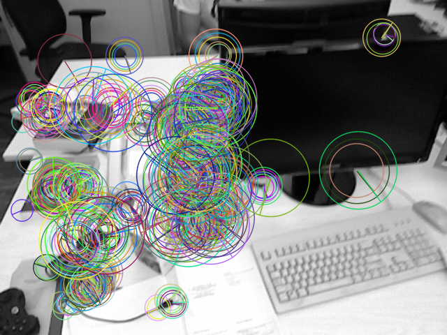
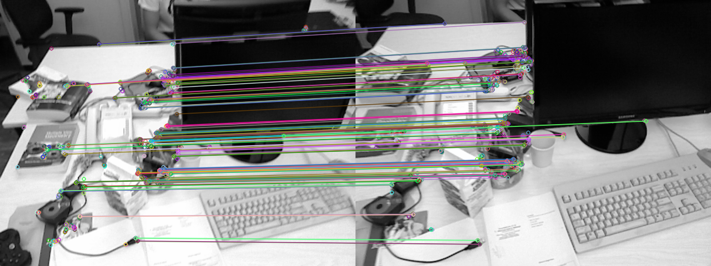

# ORB-SLAM2特征匹配——Design by 叶培楚（小C）

## 依赖项

    1. opencv 
        主要用来做图像可视化，读取图像，以及提取图像特征点和图像匹配等操作；  
    2. DBoW3
        主要用来做图像描述子的加速匹配；
        
## 编译

    1. 先编译DBoW3:  
    cd $path/DBoW3  
    mkdir build  
    cd build  
    cmake ..  
    make -j8  
    非常常规的编译!
    
    2. 编译源代码  
    cd $path/source_code (源代码所在根目录)  
    mkdir build  
    cd build  
    cmake ..  
    make -j8  

## 运行

    为了方便大家跑起来,C哥写了个bash文件,直接给bash文件加执行权限即可:
    chmod +x run.bash
    ./run.bash
    即可跑起来了.
    需要修改配置的直接在内部修改就好.
    另外,main.cpp中有bow在最近邻比例法中的阈值设置,可以按需设置.

## 思路

    在ORB-SLAM2中,特征匹配是基于DBoW指导的.具体思路为:
    1. 将图像描述子转换为DBoW词汇向量;
    2. 在两帧图像中进行DBoW词汇匹配,在这一轮匹配中,类似于界定了一个区域;
    3. 在该区域中,两帧图像中的描述子计算匹配分数,根据阈值条件判断匹配结果.

## 代码实现

    为了避免与其他模块耦合,也为了保持本模块代码的简洁,在特征提取阶段直接使用OpenCV提供的提取方法,而不是用ORB-SLAM2中的分块提取的方法.代码的具体思路为:
    1. 读取两帧图像;
    2. 对两帧图像提取ORB描述子(此处也可自行修改为其他描述子);
    3. 读取词袋模型;
    4. 将两帧图像的描述子转换为DBoW词汇向量;
    5. 两帧图像进行DBoW词汇向量匹配;(每一个词汇向量中包含同一类别的多个描述子)
    6. 在每一对匹配的词汇向量中,两帧图像各自取出在该词汇中的描述子进行计算匹配分数,根据阈值判断匹配程度.
    注: 本模块除了基于词袋模型的匹配方法,还提供了暴力匹配法,该方法是对图像1中的一个描述子在图像2中的所有描述子进行匹配,取相似度分数最高的描述子作为匹配结果,换句话说就是对于图像1中的每一个描述子都能在图像2中找到匹配结果.

    附：应读者要求,新添加投影匹配.    
    7. 基于BOW的匹配结果,算出参考帧特征点对应的三维点和当前帧匹配点的二维点;     
    8. 基于opencv3提供的solvePNP计算帧间运动,得到R和t;      
    9. 算出参考帧所有特征点的三维点和当前帧所有特征的二维像素点;      
    10. 基于步骤8算出的R和t,将参考帧的每一个三维点投影到当前帧中,并在指定搜索半径中查找匹配候选点;     
    11. 参考帧中的描述子与匹配候选点逐一匹配,找到最合适的匹配点并返回.      

## 匹配结果

    1. Kitti数据集两种匹配方式:
    ;   
    ;   
    ;   

    2. TUM数据集两种匹配方法:
    ;   
    ;
    ;

## 参考资料

 本模块是C哥为了完善博客而写的,所以本模块对应的博客为[ORB特征匹配](https://www.cnblogs.com/yepeichu/p/10723171.html).欢迎大家批评指正!      
 C哥邮箱为:peichu.ye@mail2.gdut.edu.cn,欢迎交流!
